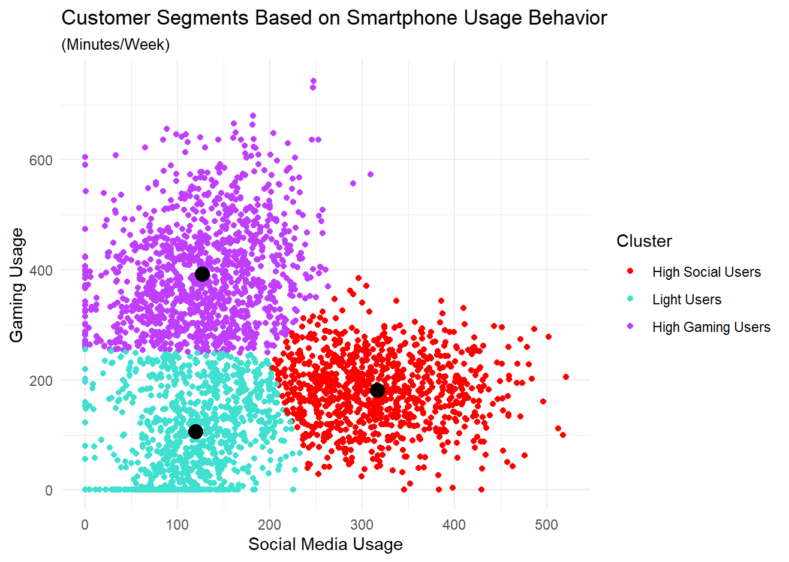
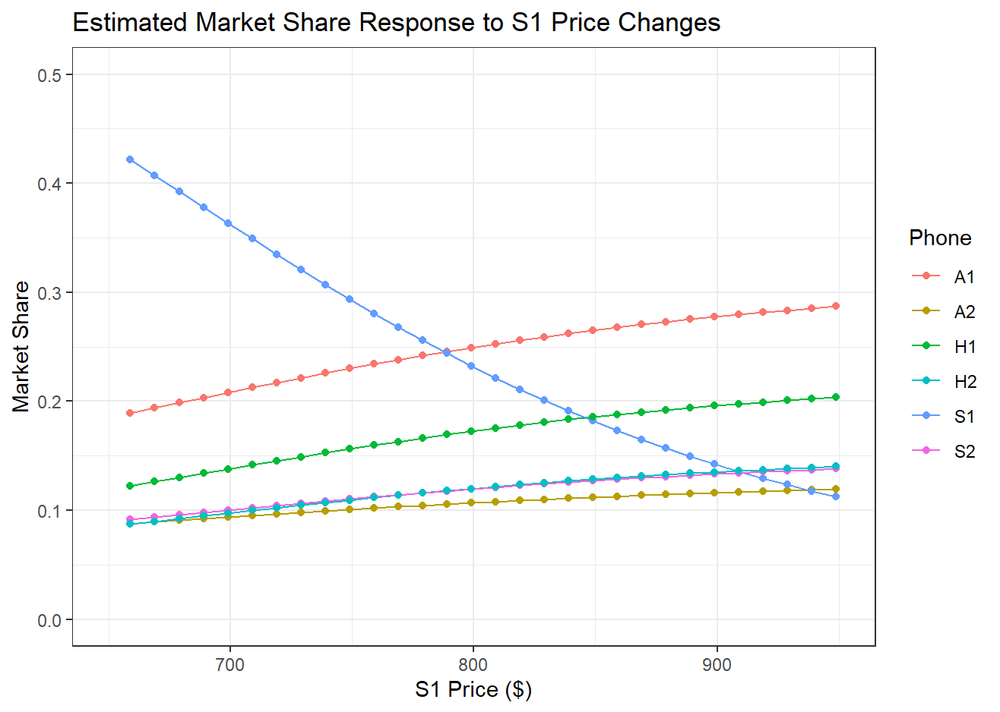

# Smartphone Customer Analytics: Segmentation, Choice Modeling & Pricing Strategy
Customer analytics project using R, K-means clustering, multinomial logit modeling, and pricing simulations to analyze smartphone purchasing behavior.

## Overview
This project analyzes smartphone purchasing behavior using customer-level demographic, usage, product, and pricing data. Using a dataset of 3,000 customer purchases, I applied K-means clustering and multinomial logit (MNL) choice modeling to identify behavioral customer segments, estimate product preferences, and evaluate strategic pricing decisions.

The analysis demonstrates how customer heterogeneity can be incorporated into predictive choice models to generate actionable insights for customer targeting, product positioning, and pricing strategy.

## Business Problem
Smartphone customers differ substantially in how they use their devices and how they respond to product attributes such as brand, screen size, and price. Treating all customers as having identical preferences can therefore overlook meaningful differences in purchasing behavior.

This project addresses three primary questions:

1. Can customers be segmented based on differences in smartphone usage behavior?
2. How do customer characteristics and product attributes influence smartphone choice?
3. Can estimated customer preferences be used to evaluate pricing decisions and competitive market-share responses?

## Dataset
The analysis uses 3,000 smartphone purchase observations containing customer demographics, smartphone usage behavior, product choices, product attributes, and pricing information.

Each customer's observed purchase was analyzed alongside the set of smartphone alternatives available to them, enabling both customer segmentation and discrete choice modeling.

> **Note:** This project was developed from coursework completed in Customer Analytics at the University of California, San Diego. Course-provided datasets and instructional materials are not redistributed in this repository.

## Analytical Approach
### 1. Customer Segmentation — K-means Clustering
Customer smartphone usage variables were standardized prior to clustering to ensure that differences in measurement scales did not disproportionately influence the results. I then applied K-means clustering to identify groups of customers with similar smartphone usage patterns.

The analysis revealed three distinct behavioral segments:

- **High Social Users** — customers characterized by comparatively high social media usage
- **Light Users** — customers with relatively low overall smartphone usage
- **High Gaming Users** — customers characterized by comparatively high gaming activity

These segments demonstrate meaningful behavioral differences across customers and provide a foundation for incorporating customer heterogeneity into subsequent smartphone choice models.

*Customer segments based on social media and gaming usage. Black points represent K-means cluster centroids.*

### 2. Smartphone Choice Modeling — Multinomial Logit
To model smartphone purchasing decisions, I applied multinomial logit (MNL) models to estimate how product attributes and customer characteristics influenced the probability of choosing among competing smartphones.

The models incorporated differences in preferences associated with:

- **Brand**
- **Price**
- **Screen size**
- **Smartphone usage behavior**
- **Behavioral customer segment**

I progressively incorporated customer heterogeneity through interactions between product attributes and customer characteristics, allowing preferences for features such as brand, price, and screen size to vary across customers.

The enhanced behavioral model achieved **44.0% brand prediction accuracy**, compared with **42.7%** for the initial segmented model — a **1.3 percentage-point improvement**.

### 3. Pricing & Competitive Simulation
Using the estimated choice model, I simulated changes in the price of a focal smartphone to evaluate how customers would respond and how demand would shift across competing products.

The simulation showed that increasing the focal product's price reduced its predicted market share while shifting demand toward competing smartphones, illustrating the substitution effects captured by the choice model.

*Predicted market-share response across six smartphone alternatives as the price of S1 changes. Higher S1 prices reduce its predicted share while competing products gain share.*

I then evaluated predicted profitability across alternative price points. Under the assumptions used in the simulation, the model identified a price of **$749**, compared with the current price of **$799**, as the profit-maximizing price within the evaluated range.

| Scenario | S1 Price | S2 Price | Predicted Profit |
| --- | ---: | ---: | ---: |
| Current Pricing | $799 | $899 | $1,253 |
| Simulated Maximum | $749 | $899 | $1,271 |

This analysis demonstrates how estimated customer preferences can be translated into pricing recommendations by balancing changes in demand, competitive substitution, and profitability.

### 4. Celebrity Endorsement Simulation
I extended the choice model to evaluate the potential impact of a celebrity endorsement on smartphone demand and profitability. The simulation increased Samsung brand preference by a specified endorsement effect and generated revised choice probabilities across the six competing smartphones.

The simulated endorsement increased predicted market share for both Samsung products, demonstrating how changes in brand perception can influence customer choice and competitive demand.

I then translated the estimated demand lift into projected financial outcomes by comparing revenues, costs, and profits before and after the endorsement scenario. This analysis illustrates how discrete choice models can be extended beyond pricing to evaluate marketing and brand strategy.

## Key Insights
- **Behavioral segmentation revealed distinct customer profiles.** K-means clustering identified High Social, Light, and High Gaming users based on differences in smartphone usage behavior.
- **Customer heterogeneity improved choice modeling.** Incorporating behavioral differences increased brand prediction accuracy from **42.7% to 44.0%**.
- **Price changes created competitive substitution effects.** As S1's price increased, its predicted market share declined while competing smartphones gained share.
- **Choice modeling supported an actionable pricing recommendation.** Within the simulated range, reducing S1's price from **$799 to $749** increased predicted total profit from **$1,253M to $1,271M**.

## Tools & Methods
**Language:** R

**Libraries:** tidyverse, ggplot2, mlogit

**Methods:** K-means Clustering, Data Standardization, Multinomial Logit (MNL), Interaction Modeling, Predictive Model Evaluation, Market Share Simulation, Pricing Analysis

